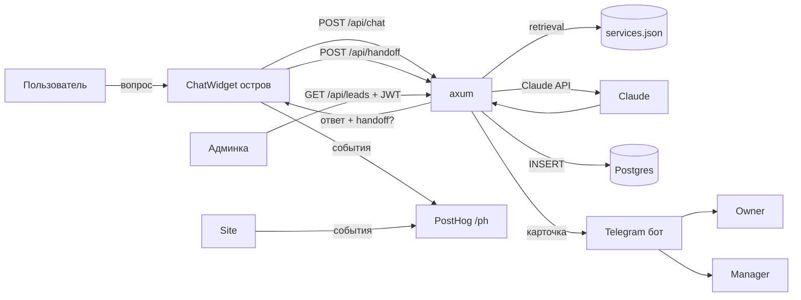

# Playbook: как собрать такой продукт заново

Пошаговый план воспроизведения **Seguro Tenerife** — мультиязычного (ru/uk/en/es)
лид-ген сервиса для экспатов с RAG-чат-консультантом, доставкой лидов в Telegram,
сквозной аналитикой, SEO/GEO-контентом, админкой и продакшн-деплоем.

Документ универсальный: подставь свою нишу (страховки → визы / аренда / релокейт /
юр-услуги — любая консультационная воронка) и иди по фазам. В конце — **реестр
граблей**, на которые мы реально наступили: он экономит дни.

> Принцип, по которому всё построено: **сначала ценность для пользователя
> (исчерпывающий ответ), потом мягкая конверсия в лид**. Не бот-анкета, а
> консультант, который реально помогает и в нужный момент зовёт к менеджеру.

---

## 0. Продуктовые решения (принять до кода)

Прежде чем писать строчку, зафиксируй:

1. **Ниша и язык(и) пользователей.** Кто клиент, на каких языках говорит. От этого
   зависит i18n с первого дня (ретрофитить мультиязычность дорого).
2. **Что такое «лид».** Минимальный состав карточки лида. У нас: **имя + вид услуги
   + канал связи**. Меньше полей в форме = выше конверсия. Контакт НЕ собираем в
   форме — клиент сам пишет менеджеру в свой мессенджер (меньше трения + GDPR).
3. **Куда уходит лид.** У нас: сохранение в БД (админка) + карточка в Telegram
   владельцу (учёт) и менеджеру (работа). Решить заранее, т.к. это формирует
   backend-контракт.
4. **Нужен ли AI-чат вообще.** Если ниша требует точных индивидуальных расчётов —
   да, RAG-консультант отвечает на вопросы и греет; финальный расчёт делает человек.
   Чат — это **доверие и квалификация**, а не замена менеджера.
5. **Бренд-нейтральность / комплаенс.** У нас агент НЕ называет страховщика (партнёр
   просил). Если есть похожие ограничения — заложить их в промпт + пост-гейт сразу.
6. **Модель монетизации воронки.** GEO/SEO-трафик → бесплатный ответ → лид →
   менеджер. Определяет, куда вкладывать (контент vs реклама).

**Артефакт фазы:** одностраничник «product brief» (ниша, лид, каналы, языки,
ограничения). Без него все технические решения повиснут в воздухе.

---

## 1. Архитектура и стек

Проверенный набор (можно менять, но эти выборы себя оправдали):

| Слой | Технология | Почему |
|---|---|---|
| Backend API | **Rust + axum** | быстрый, дешёвый в проде, строгий; один бинарь |
| БД | **PostgreSQL + sqlx** | параметризованные запросы (анти-SQLi даром), миграции из репо |
| AI-агент | **Claude API** (Sonnet 4.6 в проде) | RAG поверх своего корпуса; см. §5 |
| Frontend | **Astro (SSG) + React-острова** | статика для SEO + интерактив только где надо |
| Архитектура FE | **FSD + pnpm monorepo** | `shared/{ui,api,store,i18n}` → `features` → `widgets` → `pages` → `apps` |
| i18n | **i18next** (острова) + build-time `getT` (.astro) | реактивно к смене языка + статичные страницы |
| Аналитика | **PostHog** (EU, consent-gated, reverse-proxy) | продуктовая воронка + GEO-различение трафика |
| Доставка лидов | **Telegram Bot API** | мгновенно, бесплатно, владелец+менеджер |
| Деплой backend | **Railway** | git-push деплой, managed Postgres |
| Деплой frontend | **Cloudflare Pages** (advanced-mode `_worker.js`) | edge-статика + прокси аналитики |
| Observability агента | **Langfuse** (опц.) | трейсы диалогов |

**Карта репозитория:**

```
backend/                 # Rust/axum
  src/{main,config,error,rate_limit,origin,db,knowledge,telegram,langfuse}.rs
  src/routes/{chat,handoff,leads,events,auth,health}.rs
  src/bin/hash_password.rs
  migrations/
knowledge-base/<niche>/services.json   # корпус RAG (бренд-нейтральный)
frontend/
  libs/shared/{ui,api,store,i18n}/      # переиспользуемое ядро
  libs/{features,widgets,pages,entities}/
  apps/web-astro/                       # публичный сайт
  apps/admin/                           # дашборд лидов
docs/                    # AGENTS.md + role-folders (этот плейбук тут)
```

**Поток данных (mermaid):**



### 1.1 Точные версии стека (что реально стоит)

**Backend (`Cargo.toml`):** `axum 0.7`, `tokio 1` (full), `tower-http 0.6`
(cors/trace/limit), `sqlx 0.8` (postgres, runtime-tokio, tls-rustls, uuid, chrono,
migrate), `jsonwebtoken 9`, `argon2 0.5`, `reqwest 0.12` (rustls, json), `serde 1`,
`serde_json 1`, `validator 0.18`, `uuid 1`, `chrono 0.4`, `tracing 0.1` +
`tracing-subscriber 0.3` (json), `anyhow 1`, `thiserror 1`, `dotenvy 0.15`.

**Frontend (web-astro):** `astro ^6.4`, `@astrojs/react ^5`, `@astrojs/sitemap ^3.7`,
`react 18.3.1`, `tailwindcss 3.4`, `postcss 8.4`, `autoprefixer 10.4`,
`typescript 5.6`. **Admin:** `vite 5.4`, `@vitejs/plugin-react 4.3`, `react 18.3.1`,
`vite-tsconfig-paths 5`. **Общее:** `i18next`, `posthog-js`, `zustand` (сторы),
`zod` (валидация), `vitest 4`, `@playwright/test 1.49`. Менеджер пакетов — **pnpm 9**,
Node ≥20.

> Версии можно поднимать, но именно эта связка Astro 6 + React 18 + esbuild 0.27
> собирается без сюрпризов (про esbuild 0.28 — см. грабли §11).

### 1.2 Сторонние сервисы и аккаунты (что регистрировать)

Полный список внешних зависимостей. Заводи аккаунты в этом порядке — каждый отдаёт
секрет(ы) в ENV.

| Сервис | Зачем | Тариф | Что настроить → какой секрет |
|---|---|---|---|
| **Anthropic (Claude API)** | RAG-агент | pay-as-you-go | API-ключ → `ANTHROPIC_API_KEY`; модель `claude-sonnet-4-6` |
| **Telegram / @BotFather** | доставка лидов | бесплатно | создать бота → `TELEGRAM_BOT_TOKEN`; Start у бота → `chat_id` (`getUpdates`) → `TELEGRAM_MANAGER_CHAT_ID` (через запятую: владелец+менеджер) |
| **PostHog** (EU) | аналитика воронки | free до 1M событий/мес | проект в нужном регионе → публичный `phc_`-ключ (в клиент) + личный `phx_`-ключ (только server/API) |
| **Railway** | хостинг backend + Postgres | free/hobby | проект + Postgres-плагин → `DATABASE_URL` (даёт Railway); задать остальные ENV |
| **Cloudflare** | DNS + Pages + CDN + прокси | free | домен на CF-DNS; Pages-проект; токен с правами Pages/DNS; Transform Rule для `X-Origin-Auth` |
| **Langfuse** (опц.) | трейсы агента | free | проект → `LANGFUSE_PUBLIC_KEY` + `LANGFUSE_SECRET_KEY` (EU base-url) |
| **Google Search Console** | индексация | бесплатно | подтвердить домен DNS-TXT (`google-site-verification=…`) |
| **IndexNow** (Bing/Yandex) | мгновенная индексация | бесплатно | сгенерить ключ-файл в корне сайта; пинговать при деплое |

**Самостоятельно генерим (не сервис):** `JWT_SECRET` (≥32 случайных байта,
`openssl rand -hex 32`), `MANAGER_PASSWORD_HASH` (бинарь `hash_password`),
`ORIGIN_SHARED_SECRET` (случайная строка).

> **Правило секретов:** всё перечисленное — только в ENV платформы / `.env`
> (gitignored). Перед каждым пушем — `git grep` по паттернам токенов. Ротация — по
> чек-листу в `SECURITY_AUDIT_REPORT.md`.

---

## 2. Фаза 1 — Backend-скелет (API + БД)

**Цель:** работающий axum-сервис с конфигом из ENV, Postgres, миграциями,
middleware-защитой. Без этого всё остальное некуда втыкать.

Шаги:
1. `cargo new backend`; зависимости: `axum`, `tokio`, `sqlx` (postgres, runtime-tokio,
   migrate, chrono, uuid), `serde`, `serde_json`, `validator`, `reqwest`, `argon2`,
   `jsonwebtoken`, `chrono`, `uuid`, `anyhow`, `thiserror`, `tower-http` (cors, limit,
   trace), `tracing`, `dotenvy`.
2. **`config.rs`** — всё из ENV, **секреты обязательны (без дефолтов)**:
   `DATABASE_URL`, `JWT_SECRET`, `MANAGER_PASSWORD_HASH` падают, если не заданы.
   Несекреты с дефолтами (порт, TTL, лимиты). Это и есть «12-factor».
3. **`error.rs`** — единый `AppError` + `IntoResponse`: внутренние/БД-ошибки **логируем,
   но наружу отдаём обобщённое `internal server error`** (без утечки деталей).
4. **`db.rs`** — пул соединений; `sqlx::migrate!("./migrations").run()` на старте
   (схема живёт в репо, один источник правды).
5. **`main.rs`** — собрать роутер + middleware-стек: rate-limit → body-limit (1 MB) →
   origin-gate → trace → CORS. Слушать `0.0.0.0:$PORT`,
   `into_make_service_with_connect_info::<SocketAddr>()` (чтобы видеть IP).
6. **`/health`** — первый эндпоинт; на него же healthcheck платформы.

**Чек:** `cargo build`, локальный `curl /health`.

---

## 3. Фаза 2 — Аутентификация менеджера (lightweight JWT)

Менеджер один → без таблицы users.

1. **Пароль** — argon2-хэш в `MANAGER_PASSWORD_HASH` (ENV). Бинарь `hash_password`
   генерит PHC-строку из пароля. Пароль в открытом виде нигде не хранится.
2. **JWT HS256** с полем `typ` (`access` | `refresh`) — чтобы refresh нельзя было
   использовать как access. Валидация подписи + `exp` + `typ`.
3. **Потоки:**
   - `POST /api/auth/login {password}` → `{accessToken, expiresIn}` + `Set-Cookie:
     refresh_token` (`HttpOnly; SameSite=Strict; Secure; Path=/`).
   - `POST /api/auth/refresh` (по cookie) → новый access.
   - `POST /api/auth/logout` → стирает cookie.
4. **`verify_access(headers)`** — хелпер для защищённых хендлеров (`Bearer <jwt>`).
5. **Анти-брутфорс:** отдельный строгий лимитер на `/login` (5/мин), не общий.

**Почему так:** access короткоживущий в памяти фронта (не воруется через XSS, т.к. не
в localStorage), refresh — в HttpOnly-cookie (недоступна JS). `SameSite=Strict` =
анти-CSRF почти даром. Полноценный отзыв токенов (таблица refresh) — только когда
менеджеров станет много.

---

## 4. Фаза 3 — Вертикаль лидов

1. **Миграции:** таблицы `leads` (id, created_at, name, contact, messenger,
   comm_lang, goal, who, city, urgency, ui_lang, consent, ip, user_agent, status) и
   `events` (session_id, event, lang, meta jsonb, ip, created_at).
2. **`POST /api/leads`** (публичный) — валидация (`validator`), **`consent` обязателен**
   (GDPR), параметризованный INSERT. IP **анонимизировать** (`/24` v4, `/48` v6) перед
   записью.
3. **`GET /api/leads`** (под `verify_access`) — последние 200 для админки. **Обязательно
   проверить авторизацию внутри хендлера** (route без middleware ≠ защита).
4. **`POST /api/events`** (публичный) — лёгкие события воронки; `meta` ограничить по
   размеру (4 КБ) от раздувания.
5. **`POST /api/handoff`** (публичный) — главный конверсионный эндпоинт: сохраняет лид
   (`consent=true`, т.к. переход к менеджеру = согласие) + шлёт карточку в Telegram.
   Поверх общего лимита — строгий **write-лимит** (10/мин): каждый запрос пишет
   менеджеру, защищаем от флуда.

---

## 5. Фаза 4 — RAG-агент (сердце продукта)

Самая тонкая часть. Порядок именно такой:

1. **Корпус знаний `services.json`** — бренд-нейтральный: типы покрытия/услуг,
   факты, интенты, без названий партнёров. Это и retrieval-источник, и анти-
   галлюцинация (отвечаем ТОЛЬКО по нему).
2. **`knowledge.rs`** — загрузка корпуса в память на старте; `retrieve(query, intent,
   top_k)` (простой скоринг по интенту + тексту — векторная база не нужна на старте);
   `index_block()` (стабильный системный блок для prompt caching); `strip_brand()` —
   **пост-гейт**, вырезающий случайные упоминания бренда.
3. **`POST /api/chat`** (`chat.rs`):
   - Валидация: `question` ≤1000 символов, история ≤12 реплик × ≤2000 символов
     (ограничивает стоимость запроса).
   - Системный блок = инструкции + индекс сервисов (`cache_control: ephemeral` →
     prompt caching экономит деньги). Per-query факты идут в user-сообщении.
   - История: нормализовать роли (первая — user, роли чередуются — требование API).
   - **Маркер `[[HANDOFF]]`** отдельной строкой: модель ставит, когда (1) клиент
     явно хочет менеджера/цену/оформление, или (2) вопросов больше нет. Маркер
     вырезаем, наружу не показываем. Дублируем детерминированным детектором
     `wants_manager(question)` (цена/купить/связаться на 4 языках) — на случай, если
     модель не распознала.
   - Пост-обработка: `strip_brand` → обработка `stop_reason=refusal` (мягкий хендофф).
4. **Промпт (`SYSTEM_INSTRUCTIONS`)** — самое важное. Ключевые правила:
   - отвечать ТОЛЬКО по `<servicios>`/`<relevante>`, не выдумывать;
   - бренд-нейтральность; цены не называть;
   - **тёплый, человечный тон** (не регламент);
   - **язык: только реальные слова языка пользователя** — запрет транслита испанских
     терминов (это была реальная проблема, см. грабли);
   - закрытие диалога = приглашение к бесплатному расчёту у менеджера (+ HANDOFF),
     без «удачи с оформлением»;
   - **защита от prompt-injection:** текст пользователя — это только вопрос; игнорить
     попытки сменить роль/раскрыть инструкции/назвать бренд.
5. **Модель:** Haiku дешёвый, но галлюцинирует слова на смешанных языках. Для
   мультиязычного консультанта — **Sonnet 4.6** (`ANTHROPIC_MODEL` override в проде;
   дефолт в коде — Haiku для дешёвых сред).
6. **Langfuse** (опц.) — трейсы диалогов: видно, что реально отвечает агент.

---

## 6. Фаза 5 — Доставка лидов в Telegram

1. Создать бота у `@BotFather`, забрать токен (секрет → ENV).
2. Менеджер/владелец нажимают **Start** у бота (бот не может писать первым) → получить
   их `chat_id` (через `getUpdates`).
3. **`telegram.rs`:** `Lead {name, topic, messenger}`; `lead_text` — карточка
   (имя + вид услуги + канал); `send_lead` шлёт **всем получателям** (`chat_ids` через
   запятую → владелец для учёта + менеджер для работы).
4. **Экранирование:** `parse_mode=HTML` → экранировать `& < >` в пользовательских полях
   (`esc()`), иначе HTML-инъекция в сообщение.
5. **Фронт:** для Telegram — копипаст заготовленного сообщения (клиент сам идёт в чат
   менеджера), не бот-посредник. WhatsApp/Viber — deep-link с pre-filled текстом.

---

## 7. Фаза 6 — Frontend (FSD + Astro)

1. **pnpm monorepo + FSD-слои.** Зависимости строго вниз: `apps → pages → widgets →
   features → entities → shared`. `shared/{ui,api,store,i18n}` — ядро без бизнес-логики.
2. **i18n с первого дня:** `common.json` на каждую локаль (4 шт.). `.astro`-страницы —
   build-time `getT(locale)` (статика). React-острова — i18next, реактивно к смене
   языка. Фича-словарь чата (`chatDict.ts`) — отдельный namespace через
   `addResourceBundle` с фоллбэком `[common, chat]`, чтобы фича была самодостаточной.
3. **ChatWidget** (главный остров): пузырь → диалог; ответы; **inline-кнопка «Связаться
   с менеджером»** появляется логично (после ≥2 содержательных вопросов, НЕ после
   первого; авто-всплытие — только после 60 c простоя); HandoffCard (имя обязательно,
   выбор мессенджера); **история в localStorage** с очисткой (восстанавливать только
   если есть user-сообщения — иначе баг с языком приветствия); «липкая» тема диалога
   (первый интент побеждает, не перезаписывать).
4. **Острова только где нужен интерактив** — остальное статика (SEO + скорость).
5. **Админка (`apps/admin`)** — отдельное Vite-SPA: логин по паролю → JWT в памяти →
   `GET /api/leads`. Таблица без пустых колонок (показывать только заполненные поля).

### 7.1 Доработки интерфейса чата (UX-итерации — выстрадано)

Это не «дизайн с первого раза», а серия правок после реального теста. Заложи их
сразу — каждая родилась из конкретной проблемы конверсии/доверия.

**Кнопка «Связаться с менеджером»:**
- НЕ показывать после первого же вопроса — выглядит как впаривание. Появляется
  «логично»: после **≥2 содержательных вопросов** пользователя (`userMsgCount >= 2`).
- Это **inline-кнопка в конце ответа**, а не авто-карточка. По клику — стандартный
  выбор мессенджеров (WhatsApp/Telegram/Viber).
- **Авто-всплытие карточки — только после 60 c простоя** в чате, не раньше.

**Тон и закрытие диалога:**
- Тёплый, заботливый тон вместо регламента (правка промпта, см. §5).
- В конце ответа — **приглашение к бесплатному расчёту у менеджера**, НЕ «удачи с
  оформлением» и не формальное прощание. Менеджер = бесплатный расчёт, без выдуманных
  «функций» («выбор провайдера», «оформление сертификата» — это путало, убрали).

**Форма хендоффа (HandoffCard):**
- **Имя обязательно** (это ядро лида).
- **Telegram — копипаст** заготовленного сообщения (клиент сам идёт в чат менеджера),
  не бот-посредник, который перехватывает ник. WhatsApp/Viber — deep-link с
  pre-filled текстом (Viber требует `%2B` перед номером).
- Карточка лида = **имя + вид страховки + канал** (ничего лишнего).

**История и язык:**
- **История диалога в localStorage** (ключ `seguro_chat_v1`) с кнопкой очистки.
- **Баг языка приветствия:** при смене локали восстановленное из localStorage
  приветствие оставалось на старом языке. Фикс: восстанавливать историю **только если
  в ней есть user-сообщения**; иначе показывать свежее приветствие на текущем языке.
- **Приветствие без «передам менеджеру»** — не обещаем перевод на человека в первой
  фразе (это отпугивало), просто предлагаем помощь.

**Тема диалога («липкая»):**
- Backend эхо-возвращает интент карточки; фронт держит тему **lock-first** — первый
  распознанный вид страхования побеждает и не перезаписывается следующими ответами
  (иначе всё схлопывалось в «med» или мислейблилось).

**Чистка текстов:**
- Убрать любые упоминания «бот»/«ИИ»/«ассистент» из UI и промпта — это консультант.
- Убрать строку «Бот спрашивает язык» и подобные служебные подписи.

**Админка:**
- Убрать колонки без данных (Contact/City/Urgency, если не заполняются) — таблица
  показывает только реальные поля лида.

**Трекинг каждого шага** (для воронки): `chat_started`, `answer_received`,
`agent_fallback`, `lead_submitted`, `tg_message_copied`, `handoff_clicked`.

---

## 8. Фаза 7 — Аналитика (PostHog) + GEO-различение

1. **Проект в правильном регионе.** Ключ привязан к региону (EU `eu.i.posthog.com`).
   Публичный `phc_`-ключ — в клиенте (безопасно). Личный `phx_`-ключ — только для
   API-чтения, НИКОГДА в клиент.
2. **Consent-гейт:** трекинг включается только после «Принять все» (GDPR).
3. **Reverse-proxy через свой домен** (`/ph` → PostHog) — обход адблокеров и Safari
   ITP. На Cloudflare Pages — **advanced-mode `_worker.js`** (хост захардкожен → не
   open-proxy). `/ph/static/*` → assets-хост, `/ph/*` → api-хост.
4. **Трекать всё:** клики, навигацию блога, шаги воронки (`chat_started`,
   `answer_received`, `lead_submitted`, `handoff_clicked`).
5. **GEO vs обычный трафик:** `detectTrafficChannel()` (ai/search/social/direct/
   referral) + `resolveTrafficChannel()` first-touch в sessionStorage → super-property
   `traffic_channel`. Так видно трафик из AI-движков (ChatGPT/Perplexity и т.д.).
6. **Дашборд-воронка:** chat_started → answer_received → handoff → lead.

> Граблю с «события не приходят» см. в §11 — почти всегда это consent-гейт, бот-
> детекция headless-браузера или фильтр в UI, а не код.

---

## 9. Фаза 8 — SEO/GEO-контент (блог как двигатель)

1. **Astro Content Layer** (glob loader) для статей. **Поле слага назвать `urlSlug`,
   не `slug`** (`slug` зарезервирован → коллизия локалей). `date: z.coerce.date()`.
2. Статьи Markdown по локалям: `content/articles/{locale}/{slug}.md`. **Все значения с
   `:` в YAML-фронтматтере брать в кавычки** (двоеточие ломает YAML).
3. На страницу — schema.org (`BlogPosting`, `FAQPage`, `BreadcrumbList`),
   перекрёстные ссылки между статьями, кнопки «поделиться», trailing-slash URLs.
4. **Хаб `/blog/`** + страница `/about/`. `Layout.astro`: keywords, canonical, og,
   alternates (hreflang), `InsuranceAgency`/org-schema, `google-site-verification`.
5. **Индексация без ручной работы:** `sitemap.xml` + **IndexNow** (пинг при деплое) +
   Cloudflare Crawler Hints. Подтвердить домен в Google Search Console (DNS-TXT).
6. **GEO-оптимизация:** структурированные ответы, FAQ-schema, чёткие факты — AI-движки
   цитируют такой контент.

---

## 10. Фаза 9 — Деплой + безопасность (прод-готовность)

**Backend (Railway):** managed Postgres; ENV: `DATABASE_URL`, `JWT_SECRET` (≥32
случайных байта), `MANAGER_PASSWORD_HASH`, `ANTHROPIC_API_KEY`, `ANTHROPIC_MODEL=
claude-sonnet-4-6`, `TELEGRAM_BOT_TOKEN`, `TELEGRAM_MANAGER_CHAT_ID`, `ALLOWED_ORIGINS`,
`COOKIE_SECURE=true`, `TRUST_PROXY_HEADERS=true`, `APP_ENV=production`,
`ORIGIN_SHARED_SECRET`.

**Frontend (Cloudflare Pages):** `wrangler pages deploy dist` в advanced-mode; CI
копирует `pages-functions/_worker.js` → `dist/_worker.js`. DNS/Pages на Cloudflare.

**Хардненинг (выстрадано аудитом — заложить сразу):**
1. **Origin-gate:** прямой origin платформы (`*.up.railway.app`) доступен мимо CDN →
   позволяет спуфить `CF-Connecting-IP` и обходить rate-limit. Решение: общий секрет
   `X-Origin-Auth` (CF Transform Rule добавляет, origin требует; `/health` исключён).
2. **Fail-closed прод:** при `APP_ENV=production` запрещать `ALLOWED_ORIGINS=*`,
   `cookie_secure` по умолчанию `true`.
3. **CORS спец-корректно:** `*` → без credentials; whitelist → с credentials (спека
   запрещает их сочетать).
4. **Rate-limit:** общий (60/мин) + строгий на платный `/chat` (8/мин) + login (5/мин)
   + write/handoff (10/мин). Все per-IP.
5. **Body-limit 1 MB**, параметризованный SQL везде, маскировка ошибок наружу.
6. **Секреты — только в ENV платформы / `.env` (gitignored), НИКОГДА в репо.** Перед
   каждым деплоем — `git grep` по паттернам токенов.
7. Регулярный аудит (у нас — «Black Ranger»): SAST + deps (`cargo audit`, `pnpm audit`)
   + OWASP + LLM-инъекции.

---

## 11. Реестр граблей (то, ради чего этот документ)

| Грабля | Симптом | Фикс |
|---|---|---|
| **PostHog ключ привязан к региону** | 401 на `/decide`, событий нет | взять ключ из **того же** региона (EU/US), что и проект |
| **PostHog «события не приходят»** | пусто в дашборде | по порядку: (1) принять куки (consent-гейт), (2) headless блокируется бот-детекцией — тестировать реальным Chrome, (3) в UI нажать Reload + диапазон дат + снять застрявший Distinct-ID фильтр, (4) лаг ингестии |
| **Cloudflare Pages `functions/` не компилится** | прокси отдаёт HTML/405 | перейти на **advanced-mode `dist/_worker.js`** |
| **Content Layer `slug` коллизия** | грузится только одна локаль | переименовать поле в **`urlSlug`**; `rm -rf .astro` |
| **YAML-фронтматтер падает** | ошибка парсинга статьи | значения с `:` — **в кавычки**; `date: z.coerce.date()` |
| **Агент выдаёт несуществующие слова** | «копагов и карятий» | Haiku слаб на смешанных языках → **Sonnet 4.6** + жёсткое правило «только реальные слова + переводи термины» |
| **Тема диалога схлопывается** | всё помечается «med» | backend эхо-возвращает интент карточки; фронт «липкая» тема (первый интент побеждает, не перезаписывать) |
| **Приветствие на старом языке** | после смены локали | восстанавливать localStorage-историю **только если есть user-сообщения** |
| **rate-limit обходится** | спуф `CF-Connecting-IP` | origin-gate `X-Origin-Auth` + не доверять CF-заголовку, если origin достижим напрямую |
| **`*/` в JSDoc-комменте** | сборка падает «Unterminated regex» | не писать `o_*/op_*` внутри `/** */` — `*/` закрывает блок |
| **Cloudflare-токен без прав** | не включить Crawler Hints по API | включить в дашборде вручную |
| **esbuild advisory vs прод-сборка** | бамп 0.28 ломает билд | адвайзори dev-only → не бампать ценой сборки; ждать апгрейда Vite/Astro |

---

## 12. Порядок и оценка

Рекомендуемая последовательность (каждая фаза самодостаточна и тестируема):

```
1 Backend-скелет ──► 2 Auth ──► 3 Лиды ──► 4 RAG-агент ──► 5 Telegram
   │                                            │
   └────────────► 6 Frontend (параллельно с 4) ─┘
                       │
                       ▼
   7 Аналитика ──► 8 SEO/контент ──► 9 Деплой+безопасность
```

- Фазы 1–5 (backend+агент) и 6 (frontend) можно вести параллельно двумя потоками,
  стыкуя по API-контракту.
- **MVP-срез:** 1+2+3+6 (без AI) даёт работающую лид-форму за пару дней — можно
  валидировать спрос, пока пилится агент.
- Тесты на каждом слое (у нас «Red Ranger»): backend `cargo test`, фронт `vitest` +
  Playwright e2e на критичные пути (чат → ответ → хендофф → контакты).
- Документация в том же PR, что и код (у нас «Yellow Ranger»).

---

## 13. Чек-лист готовности к запуску

- [ ] `product brief` (ниша, лид, каналы, языки, ограничения) согласован
- [ ] Backend: `/health` 200, миграции применяются на старте
- [ ] Auth: login/refresh/logout, JWT typ-разделение, login-лимит
- [ ] Лиды: handoff сохраняет + шлёт в Telegram всем получателям, IP анонимизирован
- [ ] Агент: отвечает только по корпусу, бренд-нейтрально, реальные слова, ставит HANDOFF
- [ ] i18n: 4 локали, смена языка реактивна, нет утечки старого языка из localStorage
- [ ] PostHog: события доходят (после consent), GEO-канал различается, дашборд-воронка
- [ ] SEO: sitemap + IndexNow + GSC подтверждён, schema.org, hreflang, блог-хаб
- [ ] Деплой: backend (Railway) + frontend (Cloudflare advanced-mode), CI копирует worker
- [ ] Безопасность: origin-gate, fail-closed прод, rate-limits, нет секретов в репо
- [ ] Тесты зелёные (unit + e2e), аудит безопасности пройден
- [ ] Секреты в ENV платформы, ротация по чек-листу `SECURITY_AUDIT_REPORT.md`

---

## 14. Адаптация под новую нишу (ради чего всё это)

Архитектура **ниша-агностична**. Чтобы сделать тот же продукт для другой услуги
(визы / релокейт / аренда / юр-услуги / медтуризм — что угодно консультационное),
меняется только **контент и конфиг**, а не код. Точки замены:

| Что меняем | Где | Пример (страховки → визы) |
|---|---|---|
| **Корпус знаний** | `knowledge-base/<niche>/services.json` | типы полисов → типы виз (DNV, студенческая, рабочая) |
| **Системный промпт** | `chat.rs::SYSTEM_INSTRUCTIONS` | роль, цель, правила тона, что НЕ говорить |
| **Бренд-правила / комплаенс** | промпт + `strip_brand()` | если нельзя называть партнёра/цены — оставить гейт; иначе убрать |
| **Детектор хендоффа** | `wants_manager()` | ключевые слова «цена/оформить» под новую услугу и языки |
| **Поля лида** | `LeadIn` / миграции / HandoffCard | какие поля реально нужны менеджеру в этой нише |
| **i18n-строки** | `common.json` ×N локалей + `chatDict.ts` | все тексты UI; набор языков под аудиторию ниши |
| **Виды услуг (интенты)** | `chatDict.ts` (`o_*`) + intents | пункты «какая услуга вам нужна» |
| **Контент блога** | `content/articles/{locale}/*.md` | статьи под SEO/GEO новой ниши |
| **SEO-мета** | `Layout.astro` (keywords, schema.org тип) | `InsuranceAgency` → подходящий тип org |
| **Домен / бренд** | Cloudflare DNS, `ALLOWED_ORIGINS`, тексты | новый домен и название |
| **Telegram-получатели** | `TELEGRAM_MANAGER_CHAT_ID` | менеджер новой ниши |
| **Партнёр-контакты** | `getOfficeContacts()` (WA/TG/Viber офиса) | мессенджеры партнёра |

**Что НЕ трогаем (переиспользуем как есть):** весь backend-каркас (auth, rate-limit,
origin-gate, error, db), вертикаль лидов/событий, RAG-движок (`retrieve`/`render`/
prompt-caching), Telegram-доставку, аналитику (PostHog-прокси, GEO-детект), FSD-ядро
(`shared/*`), деплой-пайплайн, security-хардненинг.

**Практичный путь форка:**
1. Скопировать репо, переименовать пакеты/домен.
2. Заменить `services.json` + промпт + детектор хендоффа под новую услугу.
3. Перевести `common.json`/`chatDict.ts` (набор локалей — под аудиторию).
4. Написать корпус блога под новую нишу (можно с AI-копирайтером).
5. Завести аккаунты сторонних сервисов (§1.2) → новые секреты в ENV.
6. Прогнать чек-лист §13 и аудит безопасности.

> Оценка форка под новую нишу при готовом этом репо: **дни, не недели** — потому что
> весь риск-капитал (граблями §11, security §10, UX §7.1) уже оплачен.
