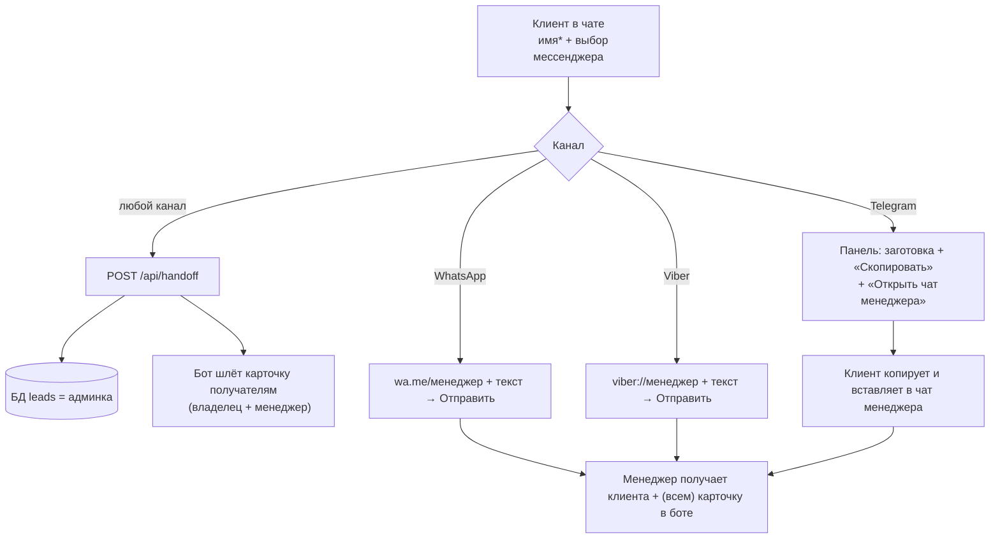

# Потоки лидов по каналам

Куда и что уходит, когда клиент в чате нажимает «Связаться» и выбирает мессенджер.

## Принцип

1. **Имя обязательно** — карточка хендоффа не даёт выбрать мессенджер, пока не
   введено имя («Как к вам обращаться?»).
2. **Учёт лида всегда** — любой выбор мессенджера шлёт `POST /api/handoff`: лид
   пишется в таблицу `leads` (видно в админке) и карточка лида уходит ботом в
   Telegram получателям (владелец для учёта + менеджер(ы)) — со **всех** каналов.
3. **WhatsApp/Viber** — клиент идёт к менеджеру напрямую по deep-link с
   предзаполненным текстом (остаётся нажать «Отправить»).
4. **Telegram** — `t.me/<username>` не предзаполняет текст, поэтому показываем
   клиенту заготовку сообщения с кнопкой **«Скопировать»** и ссылкой **«Открыть
   чат менеджера»**: клиент копирует, переходит в чат менеджера, вставляет и
   отправляет. Сверка лида — по имени (карточка в боте + имя в сообщении).

## Схема



## Таблица каналов

| Канал | Клиент идёт в | Предзаполнение | Карточка лида ботом | Учёт в админке |
|---|---|---|---|---|
| WhatsApp | Личку менеджера | Текст в deep-link (1 тап «Отправить») | ✅ на /api/handoff | ✅ |
| Viber | Личку менеджера | Текст в deep-link (1 тап «Отправить») | ✅ на /api/handoff | ✅ |
| Telegram | Личку менеджера | Заготовка + «Скопировать» (клиент вставляет) | ✅ на /api/handoff | ✅ |

> Telegram не позволяет предзаполнить текст в `t.me/username`, поэтому клиент
> копирует заготовку сам. Имя в сообщении совпадает с именем в карточке лида —
> по нему сверяем, что клиент дошёл до менеджера.

## Содержимое карточки лида (бот → Telegram)

```
🆕 Новый лид · Seguro Tenerife

👤 Имя: <имя>
📨 Мессенджер: <WhatsApp|Telegram|Viber>
🛡 Страховка: <вид страховки или —>
🌐 Язык: <ru|uk|en|es>
💬 Вопрос: <последний вопрос клиента или —>
```

## Эндпойнт

- `POST /api/handoff` `{ name*, question?, topic?, messenger?, lang? }` →
  `{ ok, lead_id }`. Сохраняет лид + шлёт карточку получателям в Telegram.

## Конфигурация (env backend)

- `TELEGRAM_BOT_TOKEN` — токен бота @seguro_tenerife_bot.
- `TELEGRAM_MANAGER_CHAT_ID` — **список** chat_id через запятую: владелец (учёт)
  и менеджер(ы). Пример: `172373152,<chat_id_менеджера>`. Получить chat_id:
  адресат нажимает Start у бота → читаем `from.id` через `getUpdates`.

Контакты на кнопках (фронт, env деплоя):

- `VITE_WHATSAPP_NUMBER` — номер WhatsApp менеджера (только цифры).
- `VITE_TELEGRAM_USERNAME` — username Telegram менеджера (без `@`).
- `VITE_VIBER_NUMBER` — номер Viber (по умолчанию = WhatsApp).

## Что нужно для полного прод-запуска

1. **Менеджер нажимает Start** у @seguro_tenerife_bot → его chat_id добавляется в
   `TELEGRAM_MANAGER_CHAT_ID` (через запятую к chat_id владельца), чтобы карточки
   шли и ему.
2. **Реальные контакты менеджера** проставляются в env деплоя фронта
   (`VITE_WHATSAPP_NUMBER` / `VITE_TELEGRAM_USERNAME` / `VITE_VIBER_NUMBER`),
   сейчас там тестовые.
