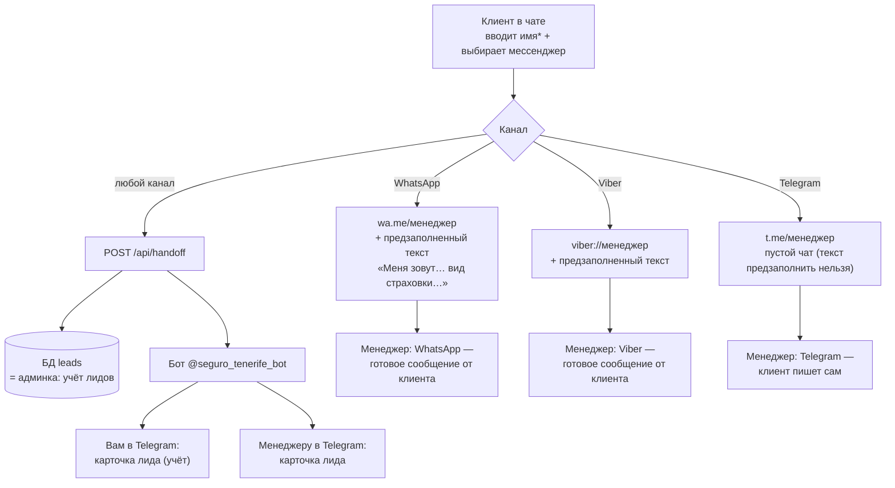

# Потоки лидов по каналам

Куда и что уходит, когда клиент в чате нажимает «Связаться» и выбирает мессенджер.

## Принцип

1. **Имя обязательно** — карточка хендоффа не даёт выбрать мессенджер, пока не
   введено имя («Как к вам обращаться?»).
2. **Учёт лида всегда** — любой переход шлёт `POST /api/handoff`, лид пишется в
   таблицу `leads` (видно в админке).
3. **Менеджер всегда получает предзаполненную карточку** — бот отправляет
   структурированную карточку лида в Telegram со **всех** каналов (даже когда
   клиент уходит в WhatsApp/Viber/Telegram). Это ключевое требование.
4. **Клиент дополнительно идёт к менеджеру напрямую** по deep-link выбранного
   мессенджера (для WhatsApp/Viber — с предзаполненным текстом).

## Схема



## Таблица каналов

| Канал | Менеджер напрямую от клиента | Карточка лида ботом (Telegram) | Учёт в админке |
|---|---|---|---|
| WhatsApp | Готовое сообщение (имя + вид страховки) | ✅ вам + менеджеру | ✅ |
| Viber | Готовое сообщение (имя + вид страховки) | ✅ вам + менеджеру | ✅ |
| Telegram | Пустой чат — клиент пишет сам | ✅ вам + менеджеру | ✅ |

> Telegram не позволяет предзаполнить текст в `t.me/username`, поэтому для этого
> канала «предзаполненную карточку» получает менеджер **через бота**, а не как
> первое сообщение клиента.

## Содержимое карточки лида (бот → Telegram)

```
🆕 Новый лид · Seguro Tenerife

👤 Имя: <имя>
📨 Мессенджер: <WhatsApp|Telegram|Viber>
🛡 Страховка: <вид страховки или —>
🌐 Язык: <ru|uk|en|es>
💬 Вопрос: <последний вопрос клиента или —>
```

## Конфигурация (env backend)

- `TELEGRAM_BOT_TOKEN` — токен бота @seguro_tenerife_bot.
- `TELEGRAM_MANAGER_CHAT_ID` — **список** chat_id через запятую: владелец (учёт)
  и менеджер(ы). Пример: `172373152,<chat_id_менеджера>`. Получить chat_id:
  адресат нажимает Start у бота → читаем `from.id` через `getUpdates`.

Контакты на кнопках (фронт, env деплоя):

- `VITE_WHATSAPP_NUMBER` — номер WhatsApp менеджера (только цифры).
- `VITE_TELEGRAM_USERNAME` — username Telegram менеджера (без `@`).
- `VITE_VIBER_NUMBER` — номер Viber (по умолчанию = WhatsApp).

## Что нужно для полного прод-запуска

1. **Менеджер нажимает Start** у @seguro_tenerife_bot → его chat_id добавляется в
   `TELEGRAM_MANAGER_CHAT_ID` (через запятую к chat_id владельца).
2. **Реальные контакты менеджера** проставляются в env деплоя фронта
   (`VITE_WHATSAPP_NUMBER` / `VITE_TELEGRAM_USERNAME` / `VITE_VIBER_NUMBER`),
   сейчас там тестовые.
