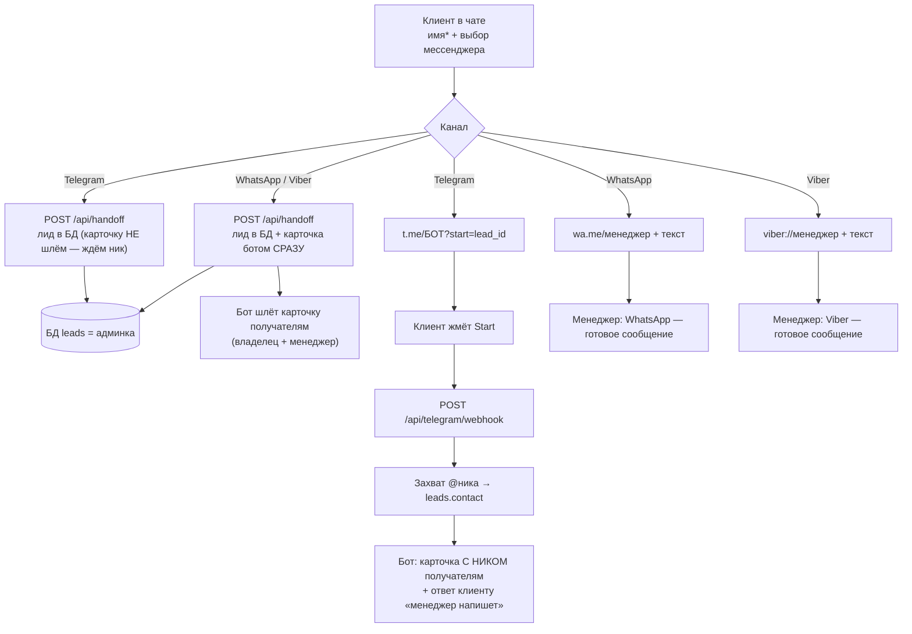

# Потоки лидов по каналам

Куда и что уходит, когда клиент в чате нажимает «Связаться» и выбирает мессенджер.

## Принцип

1. **Имя обязательно** — карточка хендоффа не даёт выбрать мессенджер, пока не
   введено имя («Как к вам обращаться?»).
2. **Учёт лида всегда** — любой переход шлёт `POST /api/handoff`, лид пишется в
   таблицу `leads` (видно в админке).
3. **Менеджер всегда получает предзаполненную карточку** — бот отправляет
   структурированную карточку лида в Telegram со **всех** каналов. Это ключевое
   требование.
4. **WhatsApp/Viber** — клиент идёт к менеджеру напрямую по deep-link с
   предзаполненным текстом; карточка дополнительно уходит ботом сразу.
5. **Telegram** — клиент идёт НЕ в личку менеджера, а в **бота**
   (`t.me/<bot>?start=<lead_id>`). Нажав Start, он отдаёт свой **@ник**; бот
   дозаписывает ник в лид и шлёт карточку (уже с ником) получателям, а клиенту
   отвечает, что менеджер скоро напишет. Так менеджер получает карточку с
   контактом клиента (в `t.me/username` текст предзаполнить нельзя).

## Схема



## Таблица каналов

| Канал | Клиент идёт в | Карточка лида ботом | @ник клиента | Учёт в админке |
|---|---|---|---|---|
| WhatsApp | Личку менеджера (готовое сообщение) | ✅ сразу на /api/handoff | — (номер виден в WA) | ✅ |
| Viber | Личку менеджера (готовое сообщение) | ✅ сразу на /api/handoff | — (номер виден в Viber) | ✅ |
| Telegram | **Бота** → Start | ✅ после Start (с ником) | ✅ захватывается ботом | ✅ |

> Telegram не позволяет предзаполнить текст в `t.me/username`, поэтому для этого
> канала «предзаполненную карточку» получает менеджер **через бота**, а не как
> первое сообщение клиента.

## Содержимое карточки лида (бот → Telegram)

```
🆕 Новый лид · Seguro Tenerife

👤 Имя: <имя>
📨 Мессенджер: <WhatsApp|Telegram|Viber>
📱 Контакт: <@ник>          ← только для Telegram (захвачен ботом)
🛡 Страховка: <вид страховки или —>
🌐 Язык: <ru|uk|en|es>
💬 Вопрос: <последний вопрос клиента или —>
```

## Эндпойнты

- `POST /api/handoff` — сохранить лид + (для WA/Viber) карточка ботом сразу.
  Принимает `lead_id` (UUID с клиента) для синхронной Telegram-ссылки.
- `POST /api/telegram/webhook` — апдейты бота. На `/start <lead_id>` захватывает
  @ник клиента, дозаписывает в `leads.contact`, шлёт карточку с ником, отвечает
  клиенту. Защита — заголовок `X-Telegram-Bot-Api-Secret-Token`.

## Конфигурация (env backend)

- `TELEGRAM_BOT_TOKEN` — токен бота @seguro_tenerife_bot.
- `TELEGRAM_MANAGER_CHAT_ID` — **список** chat_id через запятую: владелец (учёт)
  и менеджер(ы). Пример: `172373152,<chat_id_менеджера>`. Получить chat_id:
  адресат нажимает Start у бота → читаем `from.id` через `getUpdates`.
- `TELEGRAM_WEBHOOK_SECRET` — секрет вебхука; передаётся в
  `setWebhook(secret_token=…)` и сверяется на каждом апдейте.

Регистрация вебхука (разово после деплоя):

```bash
curl -X POST "https://api.telegram.org/bot<TOKEN>/setWebhook" \
  -d url=https://api.segurotenerife.com/api/telegram/webhook \
  -d secret_token=<TELEGRAM_WEBHOOK_SECRET> \
  -d 'allowed_updates=["message"]'
```

Контакты на кнопках (фронт, env деплоя):

- `VITE_WHATSAPP_NUMBER` — номер WhatsApp менеджера (только цифры).
- `VITE_TELEGRAM_USERNAME` — username Telegram менеджера (без `@`); фолбэк, если
  бот не сконфигурирован.
- `VITE_TELEGRAM_BOT_USERNAME` — username бота (без `@`) для `?start=<lead_id>`.
- `VITE_VIBER_NUMBER` — номер Viber (по умолчанию = WhatsApp).

## Что нужно для полного прод-запуска

1. **Менеджер нажимает Start** у @seguro_tenerife_bot → его chat_id добавляется в
   `TELEGRAM_MANAGER_CHAT_ID` (через запятую к chat_id владельца), чтобы карточки
   шли и ему.
2. **Реальные контакты менеджера** проставляются в env деплоя фронта
   (`VITE_WHATSAPP_NUMBER` / `VITE_TELEGRAM_USERNAME` / `VITE_VIBER_NUMBER`),
   сейчас там тестовые.
