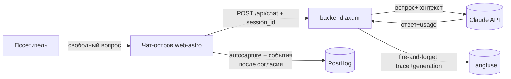

# Observability: Langfuse + PostHog

Две независимые системы: **Langfuse** — наблюдаемость AI-агента (что спросили /
что ответил), **PostHog** — продуктовая аналитика поведения на сайте. Обе
**env-driven** и без ключей — тихий no-op (dev/CI/e2e не затрагиваются).

## Langfuse — диалоги агента

**Где:** `backend/src/langfuse.rs` (+ вызов в `backend/src/routes/chat.rs`).

- На каждый ответ `/api/chat` отправляется **trace** (`name: chat`,
  `input` = вопрос, `output` = ответ, `metadata` = intent/lang/`retrieved` (id
  поднятых сервис-доков)/`brand_leaked`, `sessionId` для группировки) + вложенный
  **generation** (`model`, `usage` токены input/output, `startTime`/`endTime`).
- **Доставка:** прямой HTTP `POST {BASE_URL}/api/public/ingestion`, Basic-auth
  (public:secret). У Langfuse нет Rust-SDK → как с Claude, ходим reqwest'ом.
- **Не влияет на UX:** `tokio::spawn(log_chat(...))` после ответа пользователю;
  любая ошибка глотается (`tracing::debug!`).
- **Группировка диалога:** фронт (`askQuestion`) шлёт `session_id` из
  `getSessionId()` — он **consent-gated** (есть только при согласии на аналитику),
  поэтому без согласия трейс пишется, но без группировки в сессию.
- **Включение:** оба ключа заданы → `langfuse::enabled()` = true.

| ENV | Значение |
|---|---|
| `LANGFUSE_PUBLIC_KEY` | `pk-lf-…` (проектный) |
| `LANGFUSE_SECRET_KEY` | `sk-lf-…` — **секрет, только backend-env** |
| `LANGFUSE_BASE_URL` | EU `https://cloud.langfuse.com` (дефолт) / US / self-hosted |

Где смотреть: Langfuse → **Tracing → Traces** (трейсы `chat`, сгруппированы по
сессии). Стоимость/токены считаются из `usage` + модели.

**Приватность:** в Langfuse попадают **тексты вопросов пользователей** (это и есть
цель). Langfuse — обработчик данных → упомянуть в политике конфиденциальности;
под EU-аудиторию использовать EU-регион. Гайдовые шаги чата (кнопки) — не LLM, в
Langfuse не идут.

## PostHog — продуктовая аналитика

**Где:** `frontend/libs/shared/api/src/posthog.ts` (+ init в острове
`web-astro/.../Overlays.tsx` и `admin/.../main.tsx`).

- **Web:** autocapture (клики/просмотры/сабмиты) + pageview/pageleave + запись
  сессий **с маскировкой инпутов** (PII контактной формы) + вся воронка чата
  (фан-аут из `trackEvent`) + семантические события (`scroll_depth`,
  `section_viewed`, `faq_opened`, `chat_opened {source}`,
  `insurance_intent_selected`, `legal_opened`, `cookie_consent`,
  `lang_switched {to}`).
- **Воронка чата → лид** (`trackEvent`, фан-аут в PostHog + backend `/api/events`):
  `chat_started` → `question_asked` → `answer_received {topic, handoff}` /
  `agent_fallback {reason}` (агент недоступен/ошибка) → `chat_handoff_offered
  {source}` → `handoff_clicked {messenger, topic}` → `lead_submitted {messenger,
  topic}` (подтверждённая бэкендом конверсия) + `tg_message_copied` (Telegram).
- **Admin:** БЕЗ autocapture/записи сессий (на экранах PII лидов) — только явные
  события.
- **GDPR-гейт:** capture **выключен по умолчанию** (`opt_out_capturing_by_default`);
  включается только после согласия в баннере куки (`setAnalyticsConsent`). Ключ —
  публичный `phc_…` (безопасен в клиенте); персональный `phx_…` в клиент НЕ кладём.

| ENV (web `PUBLIC_*`, admin `VITE_*`) | Значение |
|---|---|
| `PUBLIC_POSTHOG_KEY` / `VITE_POSTHOG_KEY` | публичный проектный ключ `phc_…` |
| `PUBLIC_POSTHOG_HOST` / `VITE_POSTHOG_HOST` | EU `https://eu.i.posthog.com` (дефолт) / US — **должен совпадать с регионом проекта** |

## Тесты
- Langfuse: `cargo test` (`langfuse::tests::*` — форма batch, gate `enabled`,
  интеграция `log_chat` через mock-сервер).
- PostHog: `pnpm test` (`posthog.test.ts` — no-op без ключа, GDPR-гейт, consent).
