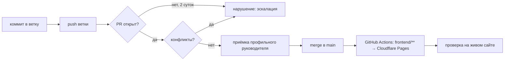

# Интеграция кода: кто отвечает за то, что написанное доезжает до `main`

Документ отвечает на один вопрос: **кто виноват, если работа сделана, а на
проде её нет.** До 23.09.2026 ответа не было ни у кого, и это не метафора —
роли с такой обязанностью в пространстве не существовало.

## Повод

21.09 на проде стояла мягкая 404: несуществующие адреса отдавали главную
страницу с кодом 200. Фикс `404.astro` был написан в тот же день и лежал в
ветке. В `main` он не попал ни 21-го, ни 22-го, ни 23-го — четыре дня Google
индексировал мусор, имея готовый фикс в репозитории (SEGU-31).

Симптом закрыли руками. Причина осталась: **ветка живёт ровно до тех пор, пока
кто-нибудь случайно не заметит, что прод её не видит.** Дневная проверка
SEO-контура (`healthcheck.py`) смотрит на свой контур; ветки `feat/*`, `fix/*`,
`agent/*` не смотрел никто.

## Владелец интеграции

**До появления роли CTO владелец интеграции — Micaela (Chief of Staff).**
Это значит конкретные обязанности, а не строчку в схеме:

| Обязанность | Что именно |
|---|---|
| Ежедневный аудит веток | `python3 scripts/analytics/branch_audit.py`, разбор нарушений в тот же день |
| Сведение в `main` | ветки без спорного содержания вливает сама; спорные — возвращает автору с названной причиной |
| Конфликты | не «ждёт, пока автор заметит», а заводит задачу на автора с перечнем конфликтующих файлов |
| Отчёт о состоянии | список невлитого — в еженедельную сводку владельцу |

Чего владелец интеграции **не** делает: не принимает содержательную работу
вместо профильного руководителя. Приёмка SEO-контура остаётся за Bencomo,
приёмка кода — за CTO, когда он появится. Интеграция — про «доехало / не
доехало», а не про «хорошо / плохо».

Роль временная и названа явно, чтобы не подразумеваться. Когда наём по SEGU-6
доведут до конца, обязанность переходит к CTO целиком — вместе с правом
принимать код.

## Правило эскалации

Применяется ко **всем** веткам репозитория, а не только к SEO-контуру.

| Состояние ветки | Порог | Что считается |
|---|---|---|
| Есть коммиты вне `main`, PR нет | **2 суток** | нарушение |
| PR открыт, не влит | **3 суток** | нарушение |
| PR с конфликтами | сразу | нарушение |
| Коммитов вне `main` нет, ветка осталась | — | мусор, не долг |

Пороги выбраны по инциденту: четыре дня простоя — уже потеря, двое суток —
ещё нет. Черновой PR (`draft`) из порога по времени исключён: он заявлен как
незаконченный.

**Эскалация — это действие, а не запись в логе.** Нарушение закрывается одним
из трёх способов в день обнаружения:

1. ветка вливается в `main`;
2. на автора заводится задача с конкретным списком того, что мешает влить;
3. ветка объявляется мёртвой и удаляется — с явным решением, а не молчанием.

Четвёртого варианта («посмотрим завтра») нет: именно он и дал четыре дня
мягкой 404.

## Механизм

```bash
python3 scripts/analytics/branch_audit.py          # отчёт по всем веткам
python3 scripts/analytics/branch_audit.py --quiet  # только нарушения
python3 scripts/analytics/branch_audit.py --json   # для автоматики
```

Скрипт сам делает `git fetch --prune`: без свежего fetch аудит врёт — покажет
влитое как невлитое. Открытые PR читает через `gh`; если `gh` недоступен,
не падает, а помечает состояние PR как неизвестное и говорит об этом в шапке.
Код возврата **1** при найденных нарушениях — чтобы годился как шаг рутины.

Скрипт лежит рядом с аналитикой (`scripts/analytics/`), но к SEO-контуру
отношения не имеет и работает в любом состоянии доступов к GSC.

Само правило (пороги, исключение для черновиков, поведение без `gh`) покрыто
тестами — `scripts/analytics/test_branch_audit.py`, 12 проверок:

```bash
python3 -m unittest discover -s scripts/analytics -p 'test_*.py'
```

Каждый порог проверяется парой «до порога тихо / за порогом громко»: правило,
которое молчит о просроченной ветке, снаружи неотличимо от правила, у которого
нет нарушений.

## Как ветка доезжает до прода



Два места, где цепочка рвалась и рвётся:

- **между `B` и `C`** — работа запушена, PR никто не открыл. Ловится аудитом.
- **между `F` и `H`** — влито, но выкат не проверен на живом сайте. Зелёный
  CI не доказательство: приёмка — `curl` по изменённым URL и `healthcheck.py`
  (см. [`../seo/pipeline.md`](../seo/pipeline.md)).

Деплой фронта и контента отдельного разрешения не требует — это решение
владельца от 08.09 (SEGU-13). Требуют подтверждения: бэкенд, DNS, рекламные
кабинеты и деньги.

## Горячая точка: начало `[Unreleased]` в CHANGELOG

Обнаружено при первом же применении этого документа 23.09: мерж в `main`
записи в **начало** секции `[Unreleased]` мгновенно сделал несводимыми два
чужих PR, которые до того сводились чисто (#4 и #5). Конфликт механический —
две разные записи претендуют на одни и те же строки, — но выглядит он как
сломанная ветка и стоит автору времени.

Правило: **новую запись в `[Unreleased]` добавляй в конец секции, а не в
начало.** Если запись всё же идёт первой — конфликт в чужих ветках создал ты,
и разводишь его тоже ты, а не автор ветки. Обратное поведение («смержил, автор
разберётся») превращает одну сэкономленную минуту в чужой полчаса и в ещё одну
ветку, которая застревает.

## Что этот документ не закрывает

Роли разработчика и CTO в пространстве нет: наём был спроектирован в SEGU-6,
согласован наполовину и потерян вместе с закрытой задачей. Пока её не довели
до конца, интеграцию держит Chief of Staff — то есть агент, который не пишет
код и не может принимать его по существу. Это заплата, а не устройство.
