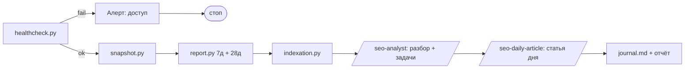

# Пайплайн проверки продвижения

Как устроено ежедневное наблюдение за органическим трафиком: что запускается,
что считается отчётом и что происходит, когда цифры меняются.

Доступы и их настройка — в [`../analytics.md`](../analytics.md). Здесь только
процесс.

## Три горизонта

Один и тот же набор данных читается три раза с разной глубиной, и это
разделение — главное решение всей конструкции.

| Горизонт | Кто | Когда | Отвечает на вопрос |
|---|---|---|---|
| **День** | `/seo-analyst` + `/seo-daily-article` | ежедневно | что сломалось и что написать сегодня |
| **Неделя** | `/seo-weekly` | понедельник | движемся ли мы и работал ли пайплайн |
| **Месяц** | `/seo-monthly` | 1-е число | о чём писать следующие 30 дней |

Почему нельзя обойтись одним слоем: на нашем объёме (сотни показов в неделю)
дневная цифра — это шум. Если принимать по ней стратегические решения, каждый
день будет отменять вчерашний. Но и ждать месяца нельзя: отвалившийся доступ
или незадеплоенный контент должны находиться за сутки, а не за тридцать.

Отсюда правило: **день реагирует, неделя измеряет, месяц решает.** Слой не
делает работу соседнего слоя — это записано в каждом скилле отдельным запретом.

## Ежедневная рутина

Пять шагов, порядок значим. Общее время — около 10 минут, из них большая часть
на индексацию.



### 1. Доступы — `healthcheck.py`

```bash
python3 scripts/analytics/healthcheck.py --json /tmp/seo-health.json
```

Проверяет: конфигурацию и права на неё, живой refresh-токен Search Console,
свежесть данных в GSC, ответ PostHog, доступность sitemap, совпадение
sitemap с репозиторием, покрытие кэша индексации.

**Ненулевой код возврата останавливает рутину.** Это не перестраховка: без
токена `report.py` печатает «пропускаю» и отчёт выглядит как «трафика нет».
Отчёт по слепым данным вреднее отсутствия отчёта — он выглядит как факт.

Два отказа стоит знать в лицо:

- **Токен Search Console.** Пока OAuth-приложение в статусе Testing,
  refresh-токен живёт 7 дней и умирает без единой ошибки на стороне отчёта.
  Лечится публикацией приложения и повторным `gsc_auth.py`.
- **sitemap vs репозиторий.** Статьи написаны, но не задеплоены — Google про
  них не знает. Самая обидная причина отсутствия трафика и единственная, где
  «нет роста» объясняется не SEO, а незавершённым релизом.

### 2. История — `snapshot.py`

```bash
python3 scripts/analytics/snapshot.py --days 30
```

Дописывает в `metrics.csv` по строке на день. Окно в 30 дней перечитывается
целиком, а не дописывается одной строкой: Google уточняет показатели последних
суток задним числом, и пропущенный запуск не должен оставлять дыру.

Без этого файла недельный отчёт невозможен: Search Console не отдаёт срез
«какая была позиция по этому запросу на такую-то дату» — только агрегаты за
период. Историю нужно копить самим, и начинать копить до того, как она
понадобится.

### 3. Трафик — `report.py`

```bash
python3 scripts/analytics/report.py --days 7  --compare --json /tmp/seo-7d.json
python3 scripts/analytics/report.py --days 28 --compare --json /tmp/seo-28d.json
```

Два окна с разными ролями: **вывод делается по 28 дням**, 7-дневное окно нужно
только чтобы заметить свежий обрыв. Внутри — PostHog (поведение, воронка чата)
и Search Console (запросы, страницы, «расстояние удара» — позиции 5–20).

### 4. Индексация — `indexation.py`

```bash
python3 scripts/analytics/indexation.py --limit 200
```

Отвечает на вопрос, которого нет в Search Analytics: **знает ли Google про
страницу вообще**. Страница без показов и страница, которую Google не видел,
в отчёте о трафике выглядят одинаково — как пустая строка.

Квота URL Inspection — 2000 запросов в сутки, в sitemap 184 URL, так что
полный обход укладывается в квоту с запасом. Кэш перепроверяет
проиндексированные раз в неделю, проблемные — каждый запуск.

### 5. Разбор и работа — скиллы

`/seo-analyst` читает собранное, проводит каждое наблюдение через таблицу
решающих правил и ставит **не больше пяти** задач копирайтеру.
`/seo-daily-article` берёт верхнюю тему из очереди и доводит её до
опубликованного состояния на четырёх локалях.

Оба скилла обязаны уметь ничего не делать: «изменений нет, действий не
требуется» и «очередь пуста, темы не выдумываю» — штатные результаты дня.
Именно этот запрет удерживает систему от производства страниц без спроса.

## Ежедневный отчёт

Короткий, ежедневный, читается за минуту. Публикуется комментарием в задаче
дня и дублируется строкой в [`journal.md`](journal.md).

```markdown
**SEO за YYYY-MM-DD** (данные Search Console по DD.MM включительно)

- Доступы: всё живо · sitemap 184 URL, все статьи задеплоены
- 28 дней: показы N (дельта) · клики N · CTR X.XX% · позиция X.X (дельта)
- Индексация: N/M в индексе, +K за сутки; вне индекса: <список или «нет»>
- Изменения выше порога: <1–3 строки или «нет»>
- Задачи копирайтеру: <нумерованный список, максимум 5, или «нет»>
- Статья дня: <тема и целевой запрос, либо «очередь пуста — режим улучшения»>
- Решил не делать: <одна строка>
```

Три свойства формата важнее его содержания:

- **Дата данных, а не дата отчёта.** Search Console отстаёт примерно на двое
  суток; «вчера просело» — это всегда ошибка, вчерашних данных ещё нет.
- **Раздел «решил не делать».** Без него одна и та же отвергнутая идея
  всплывает каждый день и каждый день заново обсуждается.
- **Пустые разделы не удаляются.** «Изменений нет» — это результат наблюдения;
  отсутствие строки неотличимо от того, что наблюдение не проводилось.

## Еженедельный отчёт

Понедельник, по данным завершившейся недели. Скилл — `/seo-weekly`.

Недельный слой существует потому, что дневной не видит тренда, а месячный
приходит слишком поздно, чтобы заметить, что рутина три дня не запускалась.

```markdown
**SEO за неделю ГГГГ-ММ-ДД — ГГГГ-ММ-ДД**

1. Доступы: <всё живо / что отвалилось и когда починено>
2. Неделя к неделе: показы N (дельта) · клики N · CTR X.XX% · позиция X.X (дельта)
3. Тренд за 4–8 недель: <одно предложение>
4. Индексация: N/M в индексе (+K за неделю); вне индекса дольше 14 дней: <список>
5. Работа пайплайна: опубликовано N статей · задач выполнено N из M · в очереди N тем
6. Вывод на следующую неделю: <одно предложение>
```

Пороги недельного слоя строже дневных: меньше 100 показов за неделю — объём
ниже порога сравнения, изменение показов меньше 30% — колебание, сдвиг позиции
меньше 2 пунктов — не сигнал. Три недели подряд в одну сторону считаются
трендом, даже если каждый отдельный шаг был мал.

Пятый пункт — не формальность. Отчёт о трафике без сведений о том, сколько
статей вышло и сколько задач выполнено, не позволяет отличить «мы работали, но
не выросли» от «мы не работали».

## Расписание

| Что | Когда | Чем запускается |
|---|---|---|
| Ежедневная рутина | ежедневно, 09:00 Atlantic/Canary | автопилот `SEO · ежедневная рутина` |
| Недельный отчёт | понедельник, 10:00 | автопилот `SEO · недельный отчёт` |
| Месячное планирование | 1-е число, 10:00 | автопилот `SEO · месячное планирование` |

Время выбрано после финализации данных Search Console за предыдущие сутки.
Недельный отчёт идёт после дневной рутины понедельника, чтобы читать уже
обновлённую историю.

Ручной запуск — теми же командами из раздела «Ежедневная рутина»; расписание
ничего не добавляет к процессу, кроме регулярности.

## Деплой — шаг рутины, а не отдельное согласование

**Решение владельца от 2026-09-08 (SEGU-13): выкатывать изменения самостоятельно,
разрешения не спрашивать.** Причина — написанный, но не выкаченный текст не влияет
ни на что: для Google его не существует, а замеры «до/после» по нему невозможны.

Как устроен выкат:

- Автодеплой — `.github/workflows/deploy-frontend.yml`, срабатывает на **push в
  `main`**, затрагивающий `frontend/**`. Собирает Astro-сайт и admin, кладёт в
  Cloudflare Pages (`seguro-web` / `seguro-admin`). Кастомные домены привязаны,
  выкат занимает около минуты.
- **Ловушка, из-за которой всё и встало:** автодеплой смотрит только на `main`.
  Коммит в ветку `feat/…` не выкатывается никогда и при этом выглядит как
  выполненная работа — в `git log` он есть, в очереди тем помечен «опубликовано».

Порядок после любой контентной правки:

```bash
cd frontend && pnpm install --frozen-lockfile && pnpm build:web && pnpm build:admin
npx vitest run                       # из frontend/, конфиг в корне монорепо
cd .. && git checkout main && git merge --ff-only <ветка> && git push origin main
python3 scripts/analytics/healthcheck.py   # инвариант «sitemap vs репозиторий» должен стать ok
```

Правила:

1. **Сборка красная — не пушим.** `main` выкатывается автоматически, сломанная
   сборка означает сломанный прод.
2. **Приёмка — живой сайт, а не зелёный CI.** Проверяем `curl` по изменённым URL:
   новый title отдаётся, число `<loc>` в `sitemap-0.xml` выросло на число новых
   страниц. `healthcheck.py` делает это же одним вызовом.
3. **Срок эксперимента считается от деплоя, а не от коммита** — см.
   [`experiments.md`](experiments.md).
4. Бэкенд, DNS, рекламные кабинеты и деньги под это разрешение не подпадают:
   оно про выкат фронта и контента.

## Когда звать человека

Автоматика останавливается и эскалирует в трёх случаях. Во всех трёх задача не
в том, чтобы что-то посчитать, а в том, чтобы человек принял решение.

| Событие | Почему нельзя чинить самим |
|---|---|
| `healthcheck.py` вернул отказ по токену или доступу | Нужен вход в Google-аккаунт владельца ресурса |
| Показы за неделю упали больше чем вдвое при неизменной позиции | Похоже на потерю верификации ресурса или блокировку — цена ошибки выше цены проверки |

Всё остальное — обычная работа пайплайна, включая недели без роста.

Раньше в этой таблице третьей строкой стояло «статьи есть в репозитории, но не
в живом sitemap → вопрос к релизу, не к SEO». Строка убрана 2026-09-08 по
решению владельца: именно она позволила неделе работы простоять невыкаченной
(SEGU-13). Незадеплоенный контент — теперь не эскалация, а шаг рутины, см. ниже.

## Что в пайплайн осознанно не входит

- **Позиции по расписанию через сторонние трекеры.** Search Console даёт
  среднюю позицию по реальным показам бесплатно и честнее, чем эмулированная
  выдача.
- **Ежедневная сверка с конкурентами.** Меняется медленно, стоит дорого;
  место такой работы — месячный слой.
- **Автоматический запрос индексации по API.** Indexing API официально
  поддерживает только вакансии и трансляции; использование его для статей —
  риск ради экономии нескольких дней ожидания.
- **Алерты на дневные колебания трафика.** При текущем объёме они будут
  срабатывать почти каждый день и обесценят сам факт алерта.
